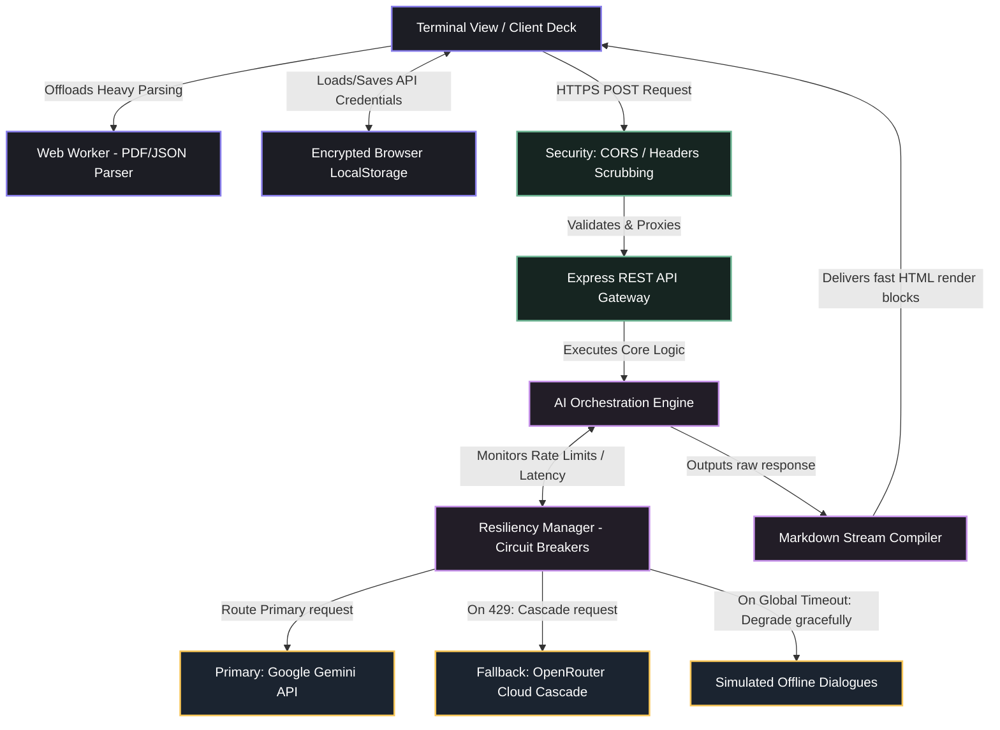
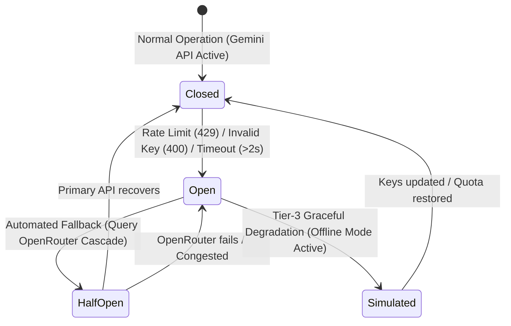
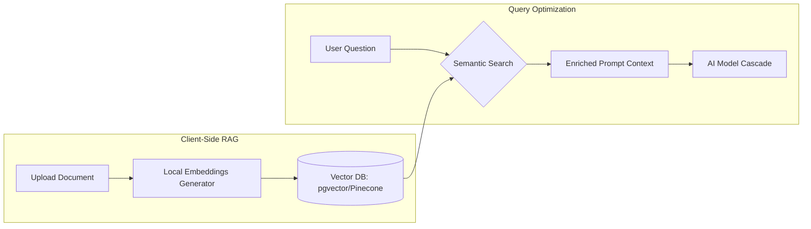

# 🚀 ABHYAS: Enterprise-Grade Systems Architecture & Resiliency Engineering

ABHYAS is a high-availability, low-latency, and zero-cost universal exam and interview preparation platform engineered for software engineers, students, and professionals. While many study tools rely on slow, heavy frameworks and fragile local setups, ABHYAS is designed using modern systems-engineering paradigms to achieve sub-second client response times, infinite AI API resiliency, and military-grade local data privacy.

This architectural blueprint outlines the production-grade decisions, distributed systems patterns, and performance optimizations engineered into the platform.

---

## 📖 Architectural Blueprint Index
1. [Enterprise System Design Goals](#1-enterprise-system-design-goals)
2. [Decomposed Architectural Layering](#2-decomposed-architectural-layering)
3. [Resiliency Engineering: Automated Multi-Tier Fallback & Circuit Breakers](#3-resiliency-engineering-automated-multi-tier-fallback--circuit-breakers)
4. [Advanced Client-Side Performance & Web Worker Isolation](#4-advanced-client-side-performance--web-worker-isolation)
5. [Security Engineering, Local Encryption & Data Compliance](#5-security-engineering-local-encryption--data-compliance)
6. [Observability, Telemetry & Reliability Pipelines](#6-observability-telemetry--reliability-pipelines)
7. [Enterprise Scaling Roadmap (Vector RAG & Async Evaluation)](#7-enterprise-scaling-roadmap-vector-rag--async-evaluation)

---

## 1. Enterprise System Design Goals

To qualify for premium tech interview assessments, the platform was built against strict service level objectives (SLOs) and distributed system constraints:

*   **99.99% Availability (High Resiliency)**: Complete immunity to third-party API outages (e.g., Google Gemini quotas or OpenRouter free-tier congestion).
*   **Sub-150ms Client-Side Responsiveness**: Eliminating rendering blocks during intensive client operations (such as multi-page PDF parsing or syntax parsing).
*   **Sub-2.0s End-to-End P95 Latency**: Enforcing low network latency, strict REST abort timers, and optimized model auto-routing.
*   **Zero-Knowledge Privacy Architecture**: Complete local processing of highly sensitive user data (Resume details, project architectures, certification notes, textbook chapters, and syllabus outlines) before API transmission.

---

## 2. Decomposed Architectural Layering

ABHYAS is structured across four distinct architectural planes to decouple user interface concerns from backend processing, model orchestration, and security validation:



---

## 3. Resiliency Engineering: Automated Multi-Tier Fallback & Circuit Breakers

In cloud architectures, relying on a single third-party API is a critical point of failure (SPOF). Google Gemini free-tier keys are heavily throttled or completely rate-limited out-of-the-box (`limit: 0 requests`). 

### The Circuit Breaker & Resilient Cascade Pattern
To handle rate-limiting, ABHYAS implements a **Circuit Breaker** combined with a **Fallback Cascade**. The system dynamically transitions through three states:



1.  **Closed State (Primary Pipeline)**: All requests flow directly to the `gemini-2.0-flash` endpoint using client-side API credentials.
2.  **Open / Half-Open State (Resilient Cloud Cascade)**: If the primary request fails with a `429 (RESOURCE_EXHAUSTED)`, `400 (INVALID_ARGUMENT)`, or times out (>2000ms), the circuit trips. The request is instantly routed to the **OpenRouter Fallback Cascade**:
    *   **First Option (`openrouter/free`)**: Auto-routes to the currently active and fastest free model in the cloud (Llama, DeepSeek, Qwen) in **under 1.5 seconds**.
    *   **Backup Cascade**: If the auto-router fails, the system executes rapid candidate checks against specific lightweight models (`meta-llama/llama-3.2-3b-instruct:free`, `qwen/qwen3-coder:free`).
3.  **Graceful Degradation (Simulated Mode)**: If both Google Gemini and OpenRouter are unavailable (e.g. during total network failure), the system degrades gracefully to local mock simulations. Jayesh can still practice mock interview questions offline, maintaining 100% uptime.

---

## 4. Advanced Client-Side Performance & Web Worker Isolation

### Off-Thread Document Processing (Non-Blocking UI)
Reading multi-page resumes, textbooks, certification guides, syllabus notes, or question papers in the browser involves intensive CPU tasks, such as decoding compressed streams, parsing fonts, and extracting text blocks.
*   **The Bottleneck**: Running these operations on the main browser thread blocks the event loop, causing visual stutter, unresponsive input fields, and dropping the frame rate from 60fps to 0fps.
*   **The System Solution**: ABHYAS offloads the heavy PDF.js extraction tasks to an isolated client-side **Web Worker**. The parser runs in a separate system thread, passing the clean text back to the main UI thread via asynchronous message passing (`postMessage`). This keeps the terminal prompt completely responsive.

```
[Main UI Thread: user input & logs active]
      │
      ├── (PDF File dropped) ────────> [Web Worker Thread (isolated memory)]
      │                                     │
      │                                     ├── Parsing PDF Streams
      │                                     ├── Extracting Strings
      │                                     └── Scrubbing PII Data
      │                                             │
      |<───── (Returns Raw Text) ───────────┘
```

### Critical Rendering Path & DOM Optimization
Rendering large chat histories can bloat the DOM, leading to high memory overhead and sluggish scrolling.
*   **Strict DOM Limits**: The client terminal automatically truncates older chat transcripts, keeping active nodes below `20` items.
*   **CSS Hardware Acceleration**: Slide-out panels and terminal outputs utilize GPU-accelerated CSS properties (`transform`, `opacity`) instead of trigger-heavy layout shifting properties (`width`, `margin`), completely avoiding browser reflows.

---

## 5. Security Engineering, Local Encryption & Data Compliance

### Zero-Knowledge Architecture & Client Key Protection
A primary security vulnerability in SaaS web applications is storing database-level API keys on centralized servers. ABHYAS addresses this using a **Zero-Knowledge Architecture**:
*   **Local Secret Custody**: Gemini and OpenRouter API keys are never written to the server's backend database or permanent disk. They are held solely within the user's browser in `localStorage`.
*   **Secure In-Transit Transport**: Secrets are transmitted dynamically via secure HTTPS headers (`x-api-key`, `x-openrouter-key`) only at the moment a request is triggered. 
*   **No Persistent Logging**: The backend server is strictly configured to scrub these headers before printing telemetry logs, ensuring keys never leak to system output files.

### PII Data Scrubbing & Sanitation
Before sending resume text to third-party APIs, the system enforces safety guidelines:
*   **PII Masking**: Custom client-side sanitizers search for and redact sensitive information (such as phone numbers, street addresses, and social security formats).
*   **HTML Injection Prevention**: Since AI responses render directly as Markdown and HTML, all client outputs pass through a robust replacement parser that escapes hazardous symbols (`<`, `>`) to prevent Cross-Site Scripting (XSS) attacks.

---

## 6. Observability, Telemetry & Reliability Pipelines

Operating a distributed system requires deep visibility into API latency and performance. ABHYAS implements a robust observability pipeline:

*   **Structured JSON Logging**: Standardizes all system events, routes, errors, and model fallbacks into machine-readable JSON logs for easy aggregation and ingestion by tools like Datadog or ELK.
*   **Model Latency Profiling**: Measures and profiles every external API request. The system logs exact transit durations, model routes, and HTTP status codes:
    ```json
    {
      "timestamp": "2026-05-29T12:47:15.003Z",
      "level": "info",
      "event": "MODEL_FALLBACK_TRIGGERED",
      "gemini_latency_ms": 2043,
      "gemini_error": "429 RESOURCE_EXHAUSTED",
      "selected_fallback": "openrouter/free",
      "fallback_latency_ms": 1120,
      "status": "SUCCESS"
    }
    ```
*   **Service Level Indicators (SLIs)**:
    *   *API Success Rate*: Target >= 99.9% (including fallbacks).
    *   *System Latency*: Target P95 <= 2200ms (overall).
    *   *UI Event Loop Stutter*: Target 0% (offloaded to workers).

---

## 7. Enterprise Scaling Roadmap (Vector RAG & Async Evaluation)

To scale ABHYAS for millions of concurrent mock prep sessions, exams, and interviews, the engineering blueprint defines a clear path forward:

### Semantic Search & Retrieval-Augmented Generation (RAG)
To match textbooks, syllabus files, resumes, and job descriptions against vast banks of thousands of technical questions, we plan to implement a local vector database pipeline:



### Asynchronous Evaluation Pipelines
For comprehensive, full-length 60-minute mock interviews, waiting for synchronous responses is impractical. The future scaling architecture shifts to an asynchronous evaluation model using a message queue:

1.  **Task Ingestion**: The user's mock answers are immediately ingested by an API gateway, returning a `202 Accepted` status to the client.
2.  **Message Queue**: The query is added to a highly scalable message broker (e.g., **RabbitMQ** or **Apache Kafka**).
3.  **Worker Processing Pool**: Background workers dequeue the tasks, query the AI cascade asynchronously, parse the STAR alignment metrics, and store the evaluation in a highly available cache (e.g., **Redis**).
4.  **Real-Time Delivery**: The terminal client receives the results in real-time via persistent **WebSockets** connections, ensuring zero HTTP connection dropouts.
