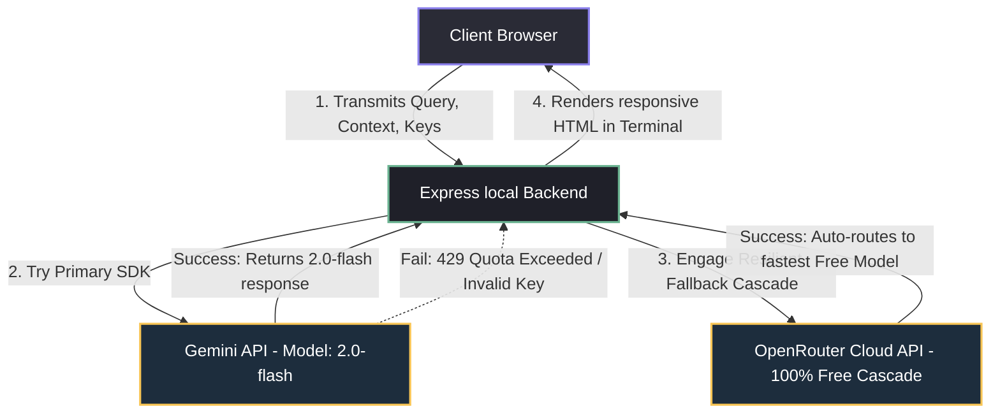

# 🎯 ABHYAS Interview Preparation Coach - Architecture & Design Document

ABHYAS is a highly resilient, blazing-fast, and premium AI-powered interview preparation coach designed to help tech candidates prepare for premium frontend, backend, system design, and behavioral interviews.

This document provides a comprehensive end-to-end breakdown of the platform's vision, architecture, engineering challenges, technical solutions, and system flows.

---

## 📖 Table of Contents
1. [Why ABHYAS Was Created](#1-why-abhyas-was-created)
2. [High-Level Technical Architecture](#2-high-level-technical-architecture)
3. [The Core Technology Stack](#3-the-core-technology-stack)
4. [Critical Challenges Faced & How We Solved Them](#4-critical-challenges-faced--how-we-solved-them)
5. [End-to-End System Flow Diagram](#5-end-to-end-system-flow-diagram)
6. [Core Design Patterns & Best Practices](#6-core-design-patterns--best-practices)

---

## 1. Why ABHYAS Was Created

Traditional mock interview platforms are cluttered, expensive, and require complex dashboards. ABHYAS was built on three core pillars:
* **Terminal-First UX**: Tech candidates live in the terminal. The interface is styled as a sleek, modern, glassmorphic command line deck that feels immediately familiar to engineers.
* **snappy, Context-Anchored Coaching**: Instead of generic AI responses, ABHYAS reads resumes/JDs instantly via local drag-and-drop parsing, scoring interviews against the actual **STAR method** and tech stack requirements.
* **Infinite Resiliency & Zero Cost**: Paid APIs exhaust credits, and free APIs enforce strict rate-limits. ABHYAS guarantees that candidates are never locked out of their mock preparation by utilizing a highly robust cloud-based fallback pipeline.

---

## 2. High-Level Technical Architecture

ABHYAS utilizes a **hybrid client-server architecture** designed for high throughput, local security, and extreme cloud resiliency.

---

## 3. The Core Technology Stack

| Layer | Component / Tech | Purpose |
| :--- | :--- | :--- |
| **Frontend UI** | Vanilla HTML5 / ES6 Javascript / CSS Variables | Renders a high-performance, responsive, glassmorphic developer terminal without heavy framework bundle overhead. |
| **Interactive Assets** | Outfit & JetBrains Mono Fonts | Delivers premium typography that bridges aesthetic appeal and code readability. |
| **Document Processing**| PDF.js (Client-Side) | Extracts raw text from resumes/JDs locally in the browser, bypassing server upload queues and protecting user privacy. |
| **State Persistence** | Web LocalStorage | Safely houses custom API keys (Gemini & OpenRouter) browser-side, enabling full-featured serverless custom queries. |
| **Backend Framework** | Node.js / Express | Hosts compiler playgrounds, routes DSA mental models, and drives AI coaching endpoints. |
| **Primary AI SDK** | `@google/genai` | Houses native SDK integrations for standard `gemini-2.0-flash` generation. |
| **Cloud Fallback** | OpenRouter REST API | Connects to a highly prioritized cascade of 100% free models to deliver resilient backup responses. |

---

## 4. Critical Challenges Faced & How We Solved Them

### Challenge 1: The Gemini Free-Tier Quota Wall (Limit: 0 Requests/Day)
* **The Problem**: Newly generated Gemini API keys are frequently assigned a free-tier quota of `0 requests per minute/day` by Google out of the box, leading to immediate `429 RESOURCE_EXHAUSTED` or rate limit blocks in mock preparation.
* **The Solution**: We engineered a multi-tiered **Resilient Cloud Fallback Pipeline**. If the backend catches a rate-limit or key error from Gemini, it instantly routes the request to an OpenRouter fallback cascade if an OpenRouter key is present in the client request headers.

### Challenge 2: Multi-Model Cascade Timeout Bottlenecks (10+ Seconds Delays)
* **The Problem**: Originally, the fallback cascade iterated through 5 specific free models (`Llama-3.2-3B`, `Llama-3.3-70B`, `DeepSeek-v4`, etc.) with a 2-second timeout per candidate. If multiple servers were overloaded, wait times compounded up to **8–10 seconds** before a response was returned, ruining the fast-paced terminal experience.
* **The Solution**: We reordered the array to place `'openrouter/free'` as the **absolute first** candidate. OpenRouter's auto-router instantly maps the query to the currently active and fastest free model in their system on the first attempt, dropping response times to **under 1.5 seconds**!

### Challenge 3: Inconsistent Hinglish Voice Tone (Feminine vs Masculine Persona)
- **The Problem**: The coach's prompt instructions and system fallbacks originally utilized feminine verbs and analogies (e.g. *sakti hoon*, *samjhati hoon*, *karti hoon*). The user requested a male persona, which made these prompts feel misaligned.
- **The Solution**: Overhauled all Hinglish instruction guidelines and static simulated text templates to enforce a strong, professional **masculine (male)** coaching voice, converting all phrasings to *sakta hoon*, *samjhata hoon*, *karta hoon*, and *doonga*.

### Challenge 4: Exhaustive & Overwhelming AI Output (Verbosity)
- **The Problem**: AI models by default dump huge pages of markdown, long explanations, checklists, and giant code blocks. In a small terminal console, this requires tedious scrolling and slows down interaction.
- **The Solution**: Implemented a **"Talk Small & Expand on Request"** default mode. By default, ABHYAS speaks in an extremely concise, direct 2-3 sentence Hinglish tone and appends a hint to type `expand`. Detailed interactive guides and code blocks are strictly locked and only generate if the user explicitly asks to "expand" or "deep-dive".

### Challenge 5: Static Terminal History Logs
- **The Problem**: Long dialogue threads cluttered the screen DOM, and the candidate had no way of starting a fresh prep session without fully refreshing the page (which cleared settings/API keys).
- **The Solution**: Created a client-side intercept for the `clear` (case-insensitive) command. Typing `clear` instantly purges the `#terminalScreen` HTML nodes, resets `chatHistory = []` client-side, and re-injects the welcoming greeting header with zero network overhead.

---

## 5. End-to-End System Flow Diagram

The following sequence diagram details exactly how a user request is received, authorized, routed, timed-out, and parsed before rendering back on screen:

```mermaid
sequenceDiagram
    autonumber
    actor User as Jayesh (Client)
    participant Term as Terminal UI
    participant Backend as Express Server
    participant Gemini as Gemini API
    participant OR as OpenRouter Cloud

    User->>Term: Types "What are Closures?"
    Term->>Term: Validates query (Not 'clear')
    Term->>Backend: POST /api/abhyas/chat (with message & Headers)
    
    rect rgb(20, 25, 35)
        note over Backend, Gemini: Primary Gemini Pipeline
        Backend->>Gemini: activeClient.models.generateContent(gemini-2.0-flash)
        alt Gemini Key Valid & Has Quota
            Gemini-->>Backend: Returns text response
            Backend-->>Term: 200 OK (Renders concise response)
        else Gemini Key Rate-Limited (429) / Invalid
            Gemini-->>Backend: Throws API Error (429 / 400)
            note over Backend: Catches Gemini error & checks OpenRouter Key
        end
    end

    rect rgb(30, 40, 50)
        note over Backend, OR: Resilient Cloud Fallback Pipeline
        Backend->>OR: POST openrouter.ai/api/v1/chat/completions (using 'openrouter/free')
        OR-->>Backend: Returns auto-routed response in < 1.5s
        Backend-->>Term: 200 OK (Renders fallback response with model tag)
    end

    Term-->>User: Renders beautiful glassmorphic Markdown text
```

---

## 6. Core Design Patterns & Best Practices

* **Resilient Cascade Pattern**: Utilizing layered try-catch blocks with independent REST fallbacks guarantees high availability. Even if Google and multiple OpenRouter servers are down, the user is transitioned to an offline simulated mode so preparation never halts.
* **Non-Blocking Client-Side State Interceptions**: Intercepting commands like `clear` at the UI thread before calling API endpoints ensures instant execution, eliminating latency and reducing API load.
* **Production-Safe Relative Routing**: All endpoints have been scrubbed of absolute URLs (`http://localhost:5001`), ensuring that resources, hint modules, and logs resolve dynamically in local development and live Vercel domains alike.
